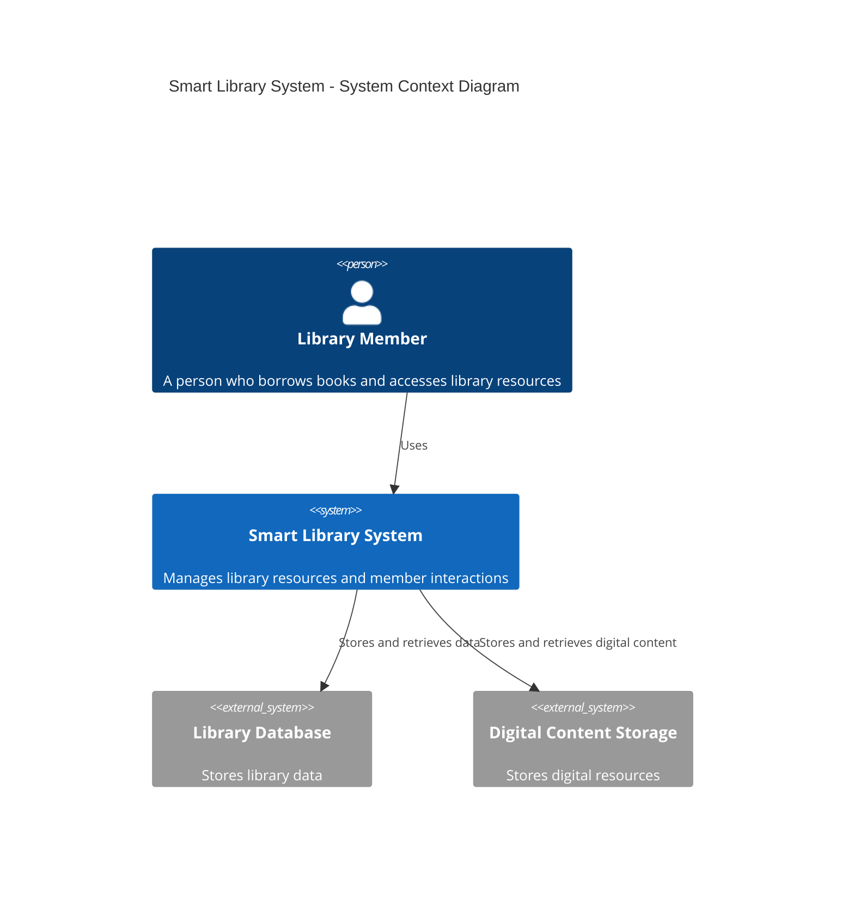

# Smart Library System Architecture

```mermaid
C4Context
    title Smart Library System - System Context Diagram
    Person(member, "Library Member", "A person who borrows books and accesses library resources")
    System(librarySystem, "Smart Library System", "Manages library resources and member interactions")
    System_Ext(database, "Library Database", "Stores library data")
    System_Ext(digitalContent, "Digital Content Storage", "Stores digital resources")

    Rel(member, librarySystem, "Uses")
    Rel(librarySystem, database, "Stores and retrieves data")
    Rel(librarySystem, digitalContent, "Stores and retrieves digital content")
```