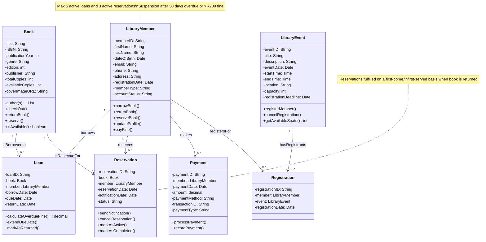

## 2. Class Diagram in Mermaid.js

The following class diagram represents the structure of the Smart Library System, detailing the classes, their attributes and methods, and the relationships between them. It is created using Mermaid.js syntax.

---

## Explanation of Key Design Decisions

### Classes
The classes directly correspond to the entities identified in the **Domain Model** (`Book`, `LibraryMember`, `Loan`, `Reservation`, `Payment`, `LibraryEvent`, and `Registration`). Each class includes attributes and methods relevant to its role in the system.

### Attributes
- Attributes are defined with basic data types (e.g., `String`, `int`, `Date`, `decimal`, `List<String>`) to provide clarity.
- The `-` symbol indicates **private attributes**.

### Methods
- Methods represent the operations that can be performed on objects of each class.
- The `+` symbol indicates **public methods**.
- Return types are specified where appropriate (e.g., `isAvailable(): boolean`, `calculateOverdueFine(): decimal`).

### Relationships

#### Association
- The relationships between classes are primarily **associations**, indicating connections between objects.

#### Multiplicity
- Multiplicity is used to specify the number of instances of one class that can be related to instances of another class:
  - `"1"`: Exactly one.
  - `"0..1"`: Zero or one.
  - `"0..*"`: Zero or more (many).
  - `"1..*"`: One or more.

### Registration Class
An explicit `Registration` class is included to handle the **many-to-many relationship** between `LibraryMember` and `LibraryEvent`.  
This class stores information about a member's registration for a specific event.

### Relationship Details
- A **Book** can be borrowed in **zero or more Loans**, and a **Loan** is associated with zero or more **Books**.  
  This reflects the possibility of a book not being currently loaned and the history of loans a book has been part of.
- A **LibraryMember** borrows **zero or more Loans**, and a **Loan** is borrowed by zero or more **LibraryMembers**.  
  This captures the borrowing activity.
- A **Book** can be reserved in **zero or more Reservations**, and a **LibraryMember** can make **zero or more Reservations**.
- A **LibraryMember** makes **zero or more Payments**.
- A **LibraryMember** can register for **zero or more Registrations**, and a **LibraryEvent** can have **zero or more Registrations**.

