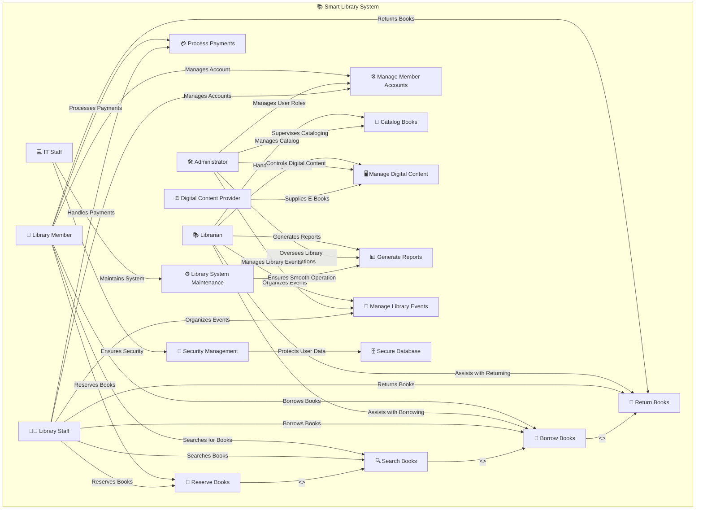

```mermaid
graph TD

    %% 🏛️ Grouping the Smart Library System
    subgraph "📚 Smart Library System"

        %% 🎭 Actors
        Member["👤 Library Member"]
        Librarian["📚 Librarian"]
        Admin["🛠️ Administrator"]
        IT["💻 IT Staff"]
        Provider["🌐 Digital Content Provider"]
        Staff["👨‍💼 Library Staff"]

        %% 📌 Core Library Functions
        Search["🔍 Search Books"]
        Borrow["📖 Borrow Books"]
        Return["🔄 Return Books"]
        Reserve["📌 Reserve Books"]
        ManageAccounts["⚙️ Manage Member Accounts"]
        Catalog["📂 Catalog Books"]
        ManageContent["🖥️ Manage Digital Content"]
        Reports["📊 Generate Reports"]
        Payments["💳 Process Payments"]
        Events["📅 Manage Library Events"]

        %% 🔗 Relationships
        Member -->|Searches for Books| Search
        Member -->|Borrows Books| Borrow
        Member -->|Returns Books| Return
        Member -->|Reserves Books| Reserve
        Member -->|Manages Account| ManageAccounts
        Member -->|Processes Payments| Payments

        Librarian -->|Manages Catalog| Catalog
        Librarian -->|Handles Digital Content| ManageContent
        Librarian -->|Generates Reports| Reports
        Librarian -->|Organizes Events| Events
        Librarian -->|Assists with Borrowing| Borrow
        Librarian -->|Assists with Returning| Return

        Admin -->|Oversees Library Operations| Reports
        Admin -->|Manages User Roles| ManageAccounts
        Admin -->|Controls Digital Content| ManageContent
        Admin -->|Supervises Cataloging| Catalog
        Admin -->|Manages Library Events| Events

        IT -->|Maintains System| System_Admin["⚙️ Library System Maintenance"]
        IT -->|Ensures Security| Security["🔐 Security Management"]

        Provider -->|Supplies E-Books| ManageContent

        Staff -->|Searches Books| Search
        Staff -->|Borrows Books| Borrow
        Staff -->|Returns Books| Return
        Staff -->|Reserves Books| Reserve
        Staff -->|Manages Accounts| ManageAccounts
        Staff -->|Handles Payments| Payments
        Staff -->|Organizes Events| Events

        %% 🔗 Inclusion & Extension Relationships
        Search -->|<<includes>>| Borrow
        Borrow -->|<<includes>>| Return
        Reserve -->|<<extends>>| Search

        %% 🔒 Security & Maintenance
        System_Admin -->|Ensures Smooth Operation| Reports
        Security -->|Protects User Data| Database["🗄️ Secure Database"]

    end
```